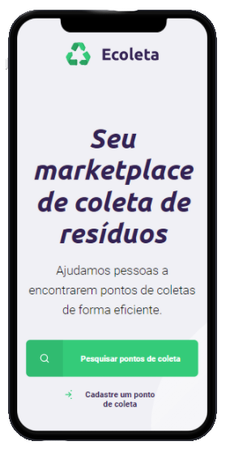

<h1 align="center">
    
</h1>

<p align="center">
  <a href="#-sobre">Sobre</a>&nbsp;&nbsp;&nbsp;|&nbsp;&nbsp;&nbsp;
  <a href="#-tecnologias">Tecnologias</a>&nbsp;&nbsp;&nbsp;|&nbsp;&nbsp;&nbsp;
  <a href="#-layout">Layout</a>&nbsp;&nbsp;&nbsp;|&nbsp;&nbsp;&nbsp;
  <a href="#-como-executar-o-projeto">Como executar</a>&nbsp;&nbsp;&nbsp;|&nbsp;&nbsp;&nbsp;
  <a href="#-licença">Licença</a>
</p>

<p align="center">
  

  
	
  
  <a href="https://github.com/pedromiiguel/Ecoleta/commits/master">
    
  </a>

  
   <a href="https://github.com/pedromiiguel/Ecoleta/stargazers">
    
  </a>
</p>


<br/>

<h1 align="center">
    
    
</h1>

## 🔖 Sobre

Desenvolvindo durante a Next Level Week 1.0 da Rocketseat, o Ecoleta é um marketplace que ajuda pessoas a encontrarem pontos de coleta de resíduos de forma eficiente. Conectando empresas que coletam resíduos orgânicos e inorgânicos a pessoas precisam descartar seus resíduos de uma forma sustentável.

## 🚀 Tecnologias

Tecnologias utilizazadas no projeto:

- [Node.js](https://nodejs.org/en/)
- [Express](https://expressjs.com/pt-br/)
- [SQLite](https://www.sqlite.org/index.html)
- [Nunjucks](https://mozilla.github.io/nunjucks/)
- [Javascript](https://developer.mozilla.org/pt-BR/docs/Web/JavaScript)
- [HTML](https://developer.mozilla.org/pt-BR/docs/Web/HTML)
- [CSS](https://developer.mozilla.org/pt-BR/docs/Web/CSS)

## 🛠 Layout

O layout da aplicação está disponível no [Figma](https://www.figma.com/file/Byw4X5etg8VCmezueyhzkC/Ecoleta-(Starter)?node-id=136%3A546). Para poder utilizá-lo é necessário uma conta no Figma.

## 🔧 Como executar o projeto

### Pré-requisitos

<p> É necessário possuir o Node.js instalado na máquina </p>
<p>E também possuir um gerenciador de tarefas NPM ou Yarn.</p>

```bash
# Clone este repositório
$ git clone https://github.com/pedromiiguel/Ecoleta

# Acesse a pasta do projeto no terminal/cmd
$ cd Ecoleta

# Instale as dependências
$ npm install

# Execute a aplicação em modo de desenvolvimento
$ npm run start

# O servidor inciará na porta:3000 - acesse http://localhost:3000 
```

## 📝 Licença

Esse projeto está sob a licença MIT.

## :man_astronaut: Autor

#### Pedro Miguel

- Git Hub: <a href="https://github.com/pedromiiguel" target='_blanck' >@pedromiiguel</a>
- Linkedin: <a href="https://www.linkedin.com/in/pedro-miiguel" target='_blanck' >@pedromiiguel</a>
